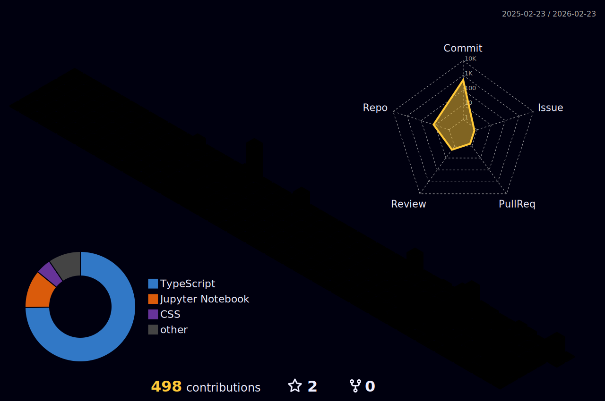

<!--horizontal divider(gradiant)-->

<header>
<!--h1 without bottom border-->

  <ul align="center">
    

      <h1 style="display: inline-block">
        Hi , I'm Ted Simwa
      </h1> 
    

  </ul>

<table align="left">
  <tr >
    <th>
      
      <a href="https://www.tedsimwa.dev/" />  My Portfolio  
    </th> 
    <th>
      
  <a href="https://www.linkedin.com/in/ted-simwa/" />   LinkedIn
    </th>
     <th>
       
        <a href="https://leetcode.com/u/tedsimwa/">LeetCode</a>
     </th>
  </tr>
  </header>

<!--- 3D Contribution Graph -->

  

<!--h2 without bottom border-->

  <ul align="center">
    
<h2 style="display: inline-block">About Me</h2>

  </ul>

<!--Intro start-->
-  I'm a **Full Stack Developer & IT Professional** passionate about building scalable web applications

-  I'm currently working on **Next.js, React, TypeScript, Node.js, MongoDB, and AWS**

-  I'm currently learning **Microservices, Kubernetes, and Advanced DevOps practices**

-  I've keen interest in **DevOps engineering** - learning **CI/CD, IaC, automation, and containerization**

-  I specialize in **React/Next.js, Node.js, TypeScript, MongoDB, AWS, Docker, Kubernetes**

-  Feel free to reach me out **simwated@gmail.com** or 
<!--Intro end-->
---

  <ul align="center">
    
<h2 style="display: inline-block">My Github Stats</h2>

  </ul>

   

  
   

  
  

<!--- stats (end) -->

<!--- Tech Stack (start) -->

  <ul align="center">
    
<h2 style="display: inline-block">Tech Stack</h2>

  </ul>

#### 🎨 Frontend Development

#### ⚙️ Backend Development

#### 🗄️ Databases & Storage

#### ☁️ Cloud & DevOps

#### 🛠️ Tools & Testing

<!--- Tech Stack (end) -->

<!--horizontal divider(gradiant)-->

