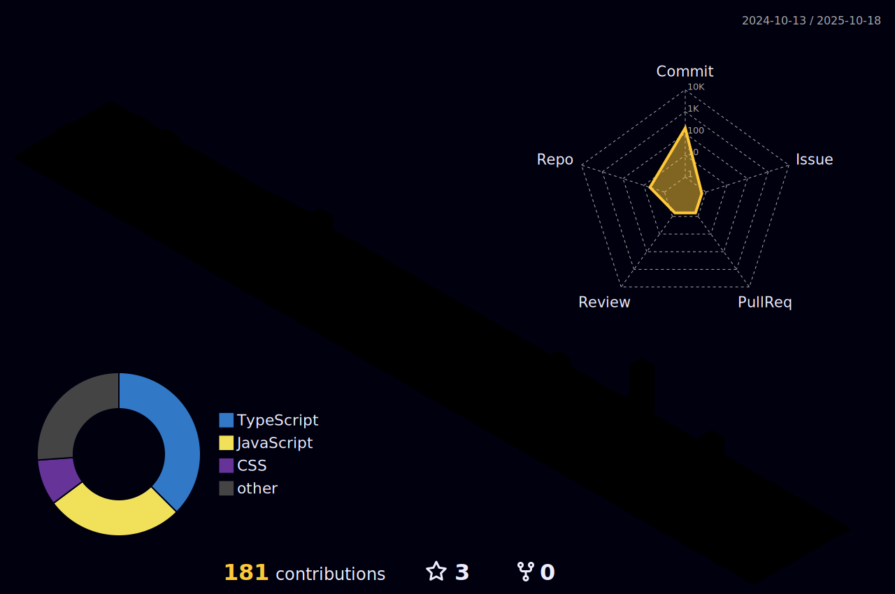

<!--horizontal divider(gradiant)-->

<!--h1 without bottom border-->

  <ul align="center">
    

      <h1 style="display: inline-block">
        Hi , I'm Ted Simwa
      </h1> 
    

  </ul>

<!--- 3D Contribution Graph -->

  

<!--h2 without bottom border-->

  <ul align="center">
    
<h2 style="display: inline-block">About Me</h2>

  </ul>

<!--Intro start-->
- 🚀 I'm a **Full Stack Developer & IT Professional** passionate about building scalable web applications

- 💻 I'm currently working on **Next.js, React, TypeScript, Node.js, MongoDB, and AWS**

- 🌱 I'm currently learning **Microservices, Kubernetes, and Advanced DevOps practices**

- ☁️ I've keen interest in **DevOps engineering** - learning **CI/CD, IaC, automation, and containerization**

- 🎯 I specialize in **React/Next.js, Node.js, TypeScript, MongoDB, AWS, Docker, Kubernetes**

- 📫 Feel free to reach me out **simwated@gmail.com** or 
<!--Intro end-->

### Here's my github stats:

   

  
   

  
  

<!--- stats (end) -->

<!--- Tech Stack (start) -->
### 🛠 &nbsp;Tech Stack 

#### 🎨 Frontend Development

#### ⚙️ Backend Development

#### 🗄️ Databases & Storage

#### ☁️ Cloud & DevOps

#### 🛠️ Tools & Testing

<!--- Tech Stack (end) -->

<!--horizontal divider(gradiant)-->

